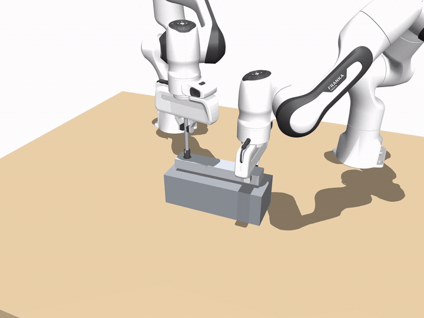
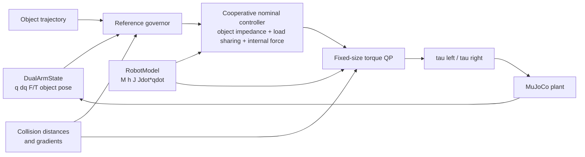

# Dual-Arm Cooperative Manipulation

[](https://github.com/haot1an/dual-arm-cooperative-manipulation/actions/workflows/ci.yml)

基于 C++17、Eigen 与 MuJoCo 的双 Franka Panda 闭链协作控制实验平台。项目覆盖刚性抓取后的协同搬运、
窄槽插入、非对称螺钉装配，以及带力矩级 QP 和在线 reference governor 的自主越障。


> 当前状态：98/98 自动测试通过；所有主要控制循环均通过 1 kHz 路径零动态内存分配测试。

## 核心能力

- 双臂协同运动学与静力学：抓取矩阵、绝对/相对 Jacobian、加权负载分配、内力零空间投影。
- 对称协作控制：物体空间阻抗、双臂 wrench 分配、内力反馈、零空间姿态保持。
- 非对称装配控制：一臂稳定工件，另一臂执行预紧、旋转和拧紧状态机。
- 固定尺寸力矩级 QP：决策变量为 `ddq(14) + lambda(6) + collision_slack(8)`，统一处理闭链、
  关节位置/速度、力矩及碰撞约束。
- 在线自主避障：reference governor 根据距离与运动方向自动执行
  `NORMAL -> LIFT -> CROSS -> DESCEND -> NORMAL`，无需手工加入越障 waypoint。
- 仿真 plant 与控制器模型分离，可向 plant 注入基座标定误差并观察闭链内力。
- 控制循环使用定长 Eigen 数据结构；测试通过 `malloc/calloc/realloc` 插桩验证零 heap allocation。

## 代表性结果

`slot_avoid` 使用相同的原始直线路径，关闭物理接触以直接观察控制器是否产生几何穿透：

| 指标 | 普通 `coop` | `qp_coop` + governor |
|---|---:|---:|
| `object~barrier` 最小距离 | -30.2 mm | +10.0 mm |
| 自主触发次数 | 0 | 1 |
| 最大避障偏移 | 0 mm | 150 mm |
| 力矩饱和步数 | 0 | 0 |
| 最大位置跟踪误差 | 8.69 mm | 13.99 mm |
| 控制耗时 mean / P99 | 11.4 / 16.8 us | 162.3 / 294.9 us |

自主版本最终 QP 约束违反为 `1.70e-9`，闭链加速度残差为 `1.75e-9`。这些数字来自一次普通
Linux Release 构建，属于面向 1 kHz 的 soft real-time 实验结果，不代表 hard real-time 保证。

## Demo Gallery

### 非对称双臂螺钉装配



左臂作为 holding arm 稳定工件，右臂作为 working arm 沿螺旋自由度调节轴向预紧力和拧紧力矩。
状态机从预紧进入旋转/力矩控制，最终到达 `HOLD`。

| 装配指标 | `qp_asym_coop` |
|---|---:|
| 螺钉转角 | -150.73 deg |
| 轴向进给 | 0.546 mm |
| 预紧力测量 / 目标 | 4.99 / 5.00 N |
| 拧紧力矩测量 / 目标 | 0.97 / 1.00 N·m |
| 工件最大位置漂移 | 1.18 mm |
| 力矩饱和步数 | 0 |
| 终止状态 | `HOLD` |

可视化运行：

```bash
./build/run_sim \
  --scene assembly \
  --controller qp_asym_coop \
  --duration 14 \
  --camera cam_front \
  --set simulation.contacts=false \
  --set 'disturbances=[]'
```

## 控制链路



QP 是关节级安全层，reference governor 负责在原始任务轨迹不可通过时修改局部参考。二者职责不同：
只靠 QP 可以限制接近速度，但不能凭空生成绕过障碍的路径。

## 场景与控制器

| 场景 | 任务 | 推荐控制器 |
|---|---|---|
| `lift` | 双臂共同抬升长杆 | `coop` / `qp_coop` |
| `slot` | 长板滚转 90 度并插入窄槽 | `qp_coop` |
| `slot_avoid` | 共同搬运、在线越障、滚转并插槽 | `qp_coop` |
| `assembly` | 左臂稳定工件、右臂旋入螺钉 | `asym_coop` / `qp_asym_coop` |
| `assembly_simple` | 双臂共同施加装配转矩 | `coop` |

其他基线包括 `gravity_pd` 和独立双臂 `cartesian_impedance`。

## 依赖与编译

已验证环境：

- CMake >= 3.16，支持 C++17 的编译器
- MuJoCo 3.12.0
- Eigen 3.4
- yaml-cpp 0.8
- GTest 1.14
- GLFW 3.3 与 zlib（可视化和截图）
- Python 3、NumPy、Matplotlib（离线绘图）
- ffmpeg（可选，录制视频）

```bash
git clone <repository-url>
cd dual_arm_ws

cmake -S . -B build -DCMAKE_BUILD_TYPE=Release
cmake --build build -j"$(nproc)"
ctest --test-dir build --output-on-failure
```

如果 MuJoCo 不在默认 CMake 搜索路径中：

```bash
cmake -S . -B build \
  -DCMAKE_BUILD_TYPE=Release \
  -Dmujoco_DIR=/path/to/mujoco/lib/cmake/mujoco
```

## 快速运行

可视化自主越障：

```bash
./build/run_sim \
  --scene slot_avoid \
  --controller qp_coop \
  --duration 20 \
  --camera cam_front \
  --set simulation.contacts=false \
  --set 'disturbances=[]'
```

运行普通协作基线：

```bash
./build/run_sim \
  --scene slot_avoid \
  --controller coop \
  --duration 20 \
  --camera cam_front \
  --set simulation.contacts=false \
  --set 'disturbances=[]'
```

可视化窗口支持：左键旋转、右键平移、滚轮缩放、`Space` 暂停、`F` 显示 site、`C` 显示接触力、
`V` 切换固定相机、`T` 切换透明显示、`Esc` 退出。

## 一键作品集实验

下面的命令会编译、运行全部测试、执行 baseline/自主避障 A/B 实验、生成指标 JSON、Markdown 汇总和全部对比图：

```bash
./scripts/run_portfolio_demo.sh
```

同时录制两个 MP4：

```bash
./scripts/run_portfolio_demo.sh --record
```

开发过程中跳过全量测试：

```bash
./scripts/run_portfolio_demo.sh --skip-tests
```

结果保存在 `artifacts/portfolio_demo/<timestamp>/`，其中包括：

```text
metrics.json
summary.md
plots/governor.png
plots/box.png
plots/timing.png
baseline.mp4              # 使用 --record 时生成
autonomous_qp.mp4         # 使用 --record 时生成
```

## 消融、鲁棒性与验收

运行四组避障消融和三组鲁棒性实验：

```bash
./scripts/run_experiment_matrix.py
```

消融组包括 `straight_coop`、`qp_only`、`governor_without_collision_damper` 和
`full_qp_governor`。后两组都保留闭链/关节 QP，但第三组关闭碰撞 damper 不等式，
用于隔离 reference governor 的贡献。鲁棒性组分别注入基座标定误差、外部 wrench 和二者组合。

一次可复现实验的核心结果如下。单独使用 QP 会在障碍前安全停止但无法完成任务；单独使用
governor 能生成越障参考，但缺少距离约束时安全裕量不足；二者组合后同时满足避障和终态精度。

| 配置 | 障碍最小距离 | 终态位置误差 | 结论 |
|---|---:|---:|---|
| 普通 `coop` | -30.12 mm | 0.00 mm | 穿透障碍 |
| 仅 QP collision damper | 9.81 mm | 114.53 mm | 安全停止，任务未完成 |
| governor，无 collision damper | 7.02 mm | 0.00 mm | 完成，但未满足 9.5 mm 裕量 |
| 完整 QP + governor | 10.00 mm | 0.00 mm | 通过 |
| 完整方案 + 标定误差 + 外扰 | 10.00 mm | 0.02 mm | 通过 |

完整实验条件和指标见 [第二阶段实验报告](docs/experiment_results.md)。

运行固定随机种子的多试次鲁棒性扫参：

```bash
./scripts/run_robustness_sweep.py --trials 12 --seed 20260923
```

该实验在预先声明的包络内随机化基座外参、外部 wrench、方向和施加时刻，输出成功率与最坏样本，
用于补充单次确定性实验。固定 seed 的 12 次回归全部通过，最坏终态位置误差为 0.501 mm，
最小障碍距离为 10.000 mm；它仍然不是实机可靠性保证。

运行所有核心场景的任务级验收：

```bash
./scripts/run_acceptance_suite.py
```

验收阈值集中在 [config/acceptance.json](config/acceptance.json)，包括终态误差、任务相关最小距离、
governor 状态序列、装配预紧/拧紧指标、力矩饱和和 P99 耗时。

持续 1 kHz soft real-time benchmark：

```bash
./scripts/run_realtime_benchmark.py --duration 60

# 可选：固定到指定 CPU
./scripts/run_realtime_benchmark.py --duration 60 --cpu 3
```

输出 mean、P99、P99.9、max 和超过 1 ms 的周期数/比例。该测试是普通 Linux 上的 soft real-time
测量，GitHub 共享 runner 不执行实时 deadline 验收。

## 日志与绘图

每次运行会在 `logs/<timestamp>_<scene>_<controller>/` 保存：

- `log.csv`：状态、力矩、F/T、weld wrench、物体参考与误差、内力、QP/governor 诊断及场景距离；
- `config.yaml`：应用场景和命令行覆盖后的实际配置；
- `run_info.txt`：命令、MuJoCo 版本、场景和控制器。

```bash
python3 scripts/plot_log.py
python3 scripts/plot_log.py --latest 2 --labels baseline autonomous_qp
python3 scripts/plot_log.py logs/run_A logs/run_B --labels A B --out artifacts/comparison
```

输出包括关节力矩、腕部 wrench、约束 wrench、物体轨迹、内力、控制耗时和 governor 状态图。

## 测试与完成指标

```bash
ctest --test-dir build --output-on-failure
```

当前结果：`98/98` 通过，覆盖：

- Jacobian、`Jdot*qdot` 与动力学量有限差分/结构验证；
- 抓取矩阵功率一致性、内力零空间与负载分配；
- 标定误差到闭链预载的传播；
- F/T 与 weld wrench 一致性；
- 场景几何、碰撞距离和距离梯度；
- 轨迹、装配状态机、QP 等式/不等式约束；
- 自主越障完整状态序列及最终插槽精度；
- 控制器、仿真步和日志组合路径零动态内存分配。

## 建模边界

- 当前研究对象是“抓取建立后的双臂闭链控制”，两手通过 MuJoCo `weld` 与物体形成刚性连接；
  未建模接近、手指闭合、摩擦锥和滑移检测。
- reference governor 在线决定触发时机和状态切换，但当前绕行方向由配置的
  `preferred_direction` 指定；它是局部避障器，不是通用 3D 路径规划器。
- 仿真在普通 Linux 用户态运行，性能数据只能说明算法满足本机 1 kHz 计算预算，不能替代
  PREEMPT_RT 或真实控制器上的 worst-case latency 验证。

## 目录

```text
apps/                 run_sim 主程序
config/               公共参数与场景覆盖
docs/                 原理、代码地图与设计记录
include/dual_arm/     公共接口
models/               工作站和 Franka MJCF/mesh
scripts/              日志绘图与一键实验
src/                  控制、QP、碰撞与仿真实现
tests/                GTest 与零分配测试
tools/                标定、场景设计辅助工具
```

进一步阅读：

- [协同控制原理](docs/cooperative_control.md)
- [第二阶段实验报告](docs/experiment_results.md)
- [项目面试问题与回答主线](docs/interview_questions.md)
- [代码地图](docs/code_map.md)
- [模型来源与许可证](models/README.md)

## License

项目自身代码使用 [MIT License](LICENSE)。`models/franka_emika_panda/` 中的第三方模型遵循其目录内的
独立许可证。
