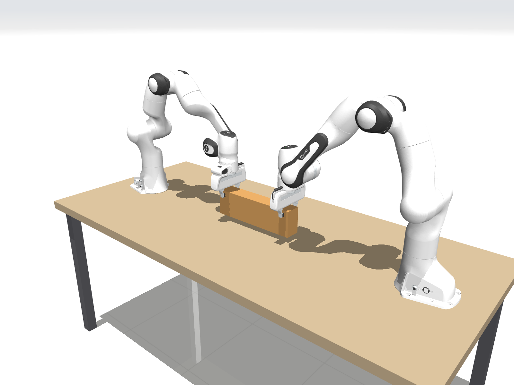

# dual_arm_ws — 双 Franka Panda 协同搬运仿真（C++ / MuJoCo）

两台带 Franka Hand 的 Panda 装在工作台上，竖直向下夹住同一个箱子的两端（夹持力由 `weld` 约束传递），用于研究
**“两臂位置 / 标定误差在闭链下转化为内力”**，以及基于绝对 / 相对任务空间、内力调节和
力矩级 QP 的协同控制。本仓库提供环境与框架；协同控制算法本身是桩函数，由使用者实现。



- 纯 CMake + C++17 + Eigen，**不依赖 ROS**；`Controller` / `RobotModel` / `types.hpp` 不依赖 MuJoCo，
  方便以后加 ROS2 封装层。
- 仿真 plant 与控制器模型是**两份独立的 mjModel**，可以给右臂基座注入标定误差。
- 1 kHz 控制，控制环内零堆分配（有测试保证）。

文档：
- [`docs/cooperative_control.md`](docs/cooperative_control.md) —— 协同控制原理（抓取矩阵、绝对/相对雅可比、内力、QP 形式、实验设计、常见坑）
- [`docs/code_map.md`](docs/code_map.md) —— 每个文件做什么、数据流、建议的实现顺序
- [`models/README.md`](models/README.md) —— 模型来源、许可证、相对 menagerie 的改动

---

## 1. 依赖（本机已确认）

| 依赖 | 版本 / 位置 | 用途 |
|---|---|---|
| MuJoCo | 3.12.0，`~/.local`（源码安装，CMake 通过 `~/.local/lib/cmake/mujoco` 找到） | 仿真、控制器模型 |
| Eigen | 3.4.0（系统） | 线性代数 |
| yaml-cpp | 0.8.0（系统） | 配置 |
| GLFW | 3.3.10（系统） | 可视化（可选，`-DDUAL_ARM_BUILD_VIEWER=OFF` 关闭） |
| GTest | 1.14.0（系统） | 测试 |
| Python 3 + numpy + matplotlib | 系统 python3 | `scripts/plot_log.py`（不需要 pandas） |

可选依赖见 §7。

## 2. 编译

```bash
cd /home/tt/dual_arm_ws
cmake -B build            # 默认 Release
cmake --build build -j
```

产物：`build/run_sim`、`build/dual_arm_tests`、`build/test_no_alloc`、`build/libdual_arm_core.a`。
CMake 选项：`DUAL_ARM_BUILD_TESTS`（ON）、`DUAL_ARM_BUILD_VIEWER`（ON）、`DUAL_ARM_WITH_OSQP`（OFF）、
`DUAL_ARM_WITH_PINOCCHIO`（OFF）、`DUAL_ARM_WERROR`（OFF）。

## 3. 运行

```bash
./build/run_sim --headless --duration 5            # 无界面全速运行（基线 GravityCompJointPD）
./build/run_sim                                     # 可视化，按实时速率运行（默认 10 s，结束后窗口保持）
./build/run_sim --controller coop                   # 协同控制器（目前是桩：只补偿两臂自重，箱子重量会把两臂拉下约 0.5 m；工作台无碰撞，会穿过台面）
./build/run_sim --headless --calib-error            # 打开右臂基座标定误差（默认 3/−3/2 mm + 0.3° yaw）
./build/run_sim --headless --calib-error --set weld.init_mode=nominal   # 带“装配误差”预载
./build/run_sim --set object_trajectory.type=min_jerk --set 'disturbances=[]'
./build/run_sim --camera cam_front                  # 可视化时直接用固定相机（cam_iso | cam_front）
./build/run_sim --duration 0 --no-log --camera cam_iso --screenshot docs/img/scene.png   # 生成文档里的场景图
./build/run_sim --help
```

- 任意配置项都可以用 `--set 键路径=值` 覆盖（值按 YAML 解析）。**zsh 下值里有 `[]` 时要加引号。**
- 可视化窗口：左键旋转、右键平移、滚轮缩放；`Space` 暂停、`F` 显示 site 坐标系、`C` 接触力、
  `V` 依次切换自由相机 / `cam_iso` / `cam_front`、`T` 透明、`Esc` 退出。
- `--camera NAME`：使用 MJCF 中定义的固定相机（`cam_iso` 等轴测、`cam_front` 正视两臂连线），
  保证不同实验的截图 / 录像视角一致。
- `--screenshot PATH`：隐藏窗口运行 `--duration` 秒（可以为 0，即初始构型）后离屏渲染一帧并退出；
  `.png` 存 PNG（zlib 压缩，1600×1200），其它扩展名存 PPM。默认相机 `cam_iso`。
- 启动时打印两臂初始构型的雅可比条件数与各关节到限位的裕度；结束时打印控制器平均/最大耗时、
  箱子最大漂移、最大 weld 力、力矩饱和步数。

运行输出在 `logs/<YYYYmmdd_HHMMSS>_<controller>[_calib]/`：

| 文件 | 内容 |
|---|---|
| `log.csv` | 每步一行，139 列（列说明见 `include/dual_arm/logger.hpp`） |
| `config.yaml` | 本次**实际生效**的配置（已应用命令行覆盖）+ 命令行 |
| `run_info.txt` | 命令行、MuJoCo 版本、模型路径 |

## 4. 画图

```bash
python3 scripts/plot_log.py                                  # 最新一次运行 → <run>/plots/*.png
python3 scripts/plot_log.py --latest 2 --labels baseline coop   # 最新两次画在一起 → logs/compare_*/
python3 scripts/plot_log.py logs/A logs/B --labels A B --tmax 4
```

输出：关节力矩、腕部 F/T 换算 wrench、weld 约束 wrench（真值）、箱子位移与位姿误差（灰色 = 扰动时段）、
控制器耗时、内力（`int_*` 列；在你实现 `coop::internalWrenchForLogging` 之前自动跳过）。

## 5. 测试

```bash
cd build && ctest --output-on-failure        # 或 ./build/dual_arm_tests / ./build/test_no_alloc
```

当前结果：**32 通过，6 跳过**。跳过的是 `CoopTemplate.*` 测试模板——它们针对协同运动学桩函数
（G·零空间内力 = 0、理想闭链下 J_r·dq = 0 等），桩函数返回 NaN 时自动 `GTEST_SKIP`，实现后自动生效
（已用一份临时参考实现验证过这些模板本身是正确的）。

## 6. 配置要点（`config/default.yaml`）

| 段 | 说明 |
|---|---|
| `arms` | 名义基座位姿（台面上，相距 1.49 m）、`q_init`（C++ 以这里为准，编译前覆盖 XML 中的基座位姿） |
| `calibration_error` | 只作用于 plant 的右臂基座：`p_true = p_nom + Δp`，`R_true = R(Δrpy)·R_nom` |
| `weld` | `init_mode: current`（t=0 无预载）/ `nominal`（名义几何，带标定误差时产生预载，0.5 s 平滑过渡）；`solref/solimp` |
| `disturbances` | 施加在箱子质心的外力/外力矩（世界系），可多段 |
| `sensors.fix_weld_torque` | 修正 MuJoCo 3.12 F/T 传感器中 weld 力矩翻倍的问题（见下） |
| `object_trajectory` | 物体参考轨迹 `hold` / `min_jerk` / `sine`（日志中的 `obj_err_*` 相对于它） |
| `controller` | `gravity_pd` 增益、`coop` 参数占位 |
| `log` | 目录、抽样间隔 |

## 7. 可选依赖与本机环境的注意事项

- **OSQP / OsqpEigen**（给以后的力矩级 QP）：`/usr/local` 下的 `libOsqpEigen.so`（0.11.2）实际是针对
  **ROS jazzy 的 OSQP 0.6.2**（`/opt/ros/jazzy/lib/libosqp.so`）编译的；`/usr/local` 下另有一份 OSQP 1.x，
  两者 SONAME 都是 `libosqp.so`。`-DDUAL_ARM_WITH_OSQP=ON` 可以编译并通过 `test_osqp_smoke`，但会链接到
  ROS 的 OSQP。若要完全脱离 ROS，建议用 OSQP 1.x 重新编译 osqp-eigen（或在工程里用 FetchContent 自带一份）。
- **Pinocchio**：未安装。可 `sudo apt install ros-jazzy-pinocchio`（4.1.0），它只是装在 `/opt/ros/jazzy`
  下的普通 C++ 库；之后 `-DDUAL_ARM_WITH_PINOCCHIO=ON` 即可在 CMake 中找到。实现 `RobotModel` 的
  Pinocchio 版本时，`tests/test_jacobian.cpp` 可以直接对拍。
- **MuJoCo 3.12 的 F/T 传感器与 weld**：`mj_rnePostConstraint` 把 weld 转动约束力直接当作世界系力矩，
  而约束真正施加的力矩是 `Jᵀf`（带 0.5 系数），导致腕部力矩读数中 weld 部分偏大一倍（力不受影响）。
  `SimEnv` 默认做了精确修正（`sensors.fix_weld_torque: true`），测试 `RawMujocoTorqueDoublesWeldContribution`
  复现了原始行为；升级 MuJoCo 后若该测试失败，说明上游已修复，应关闭修正。
- 本机 shell 会 source ROS jazzy。默认构建不会用到 `/opt/ros` 下的任何包（CMake 输出中打印了各依赖的路径，可核对）。

## 8. 目录

```
CMakeLists.txt  README.md  config/  models/  include/dual_arm/  src/  apps/  scripts/  tests/  docs/  logs/(git 忽略)
```

详见 [`docs/code_map.md`](docs/code_map.md)。
