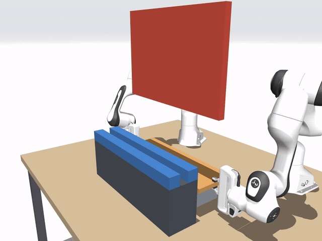
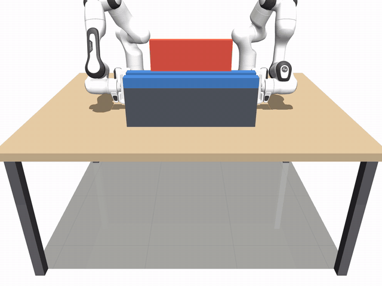
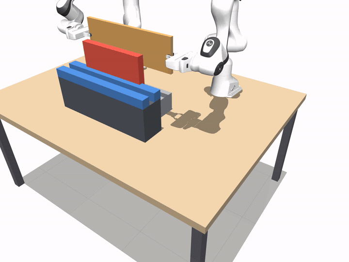
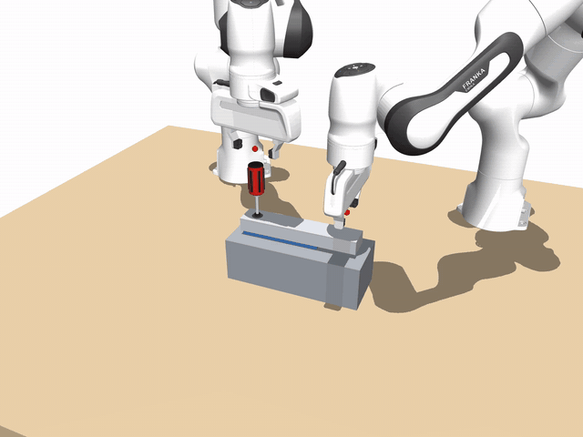
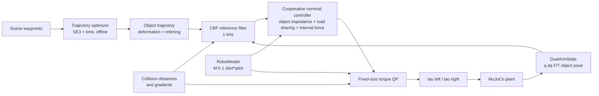

# Dual-Arm Cooperative Manipulation

[](https://github.com/haot1an/dual-arm-cooperative-manipulation/actions/workflows/ci.yml)

基于 C++17、Eigen 与 MuJoCo 的双 Franka Panda 闭链协作操作平台。覆盖协同搬运、窄槽插入、非对称螺钉装配，
并实现了一套分层避障架构：**物体空间轨迹优化**决定怎么走，**CBF 参考滤波**保证执行中不撞，**力矩级 QP** 最后兜底。
抓取既可以用刚性 weld 基线，也可以用真实的手指摩擦接触（含抓取对准）。



*`slot_gate`：长板须从低矮横梁下方穿过再插入窄槽。物体 SE(3) + 时间联合优化找到“边抬升边滚转、约 60° 斜着穿梁、边走边转完”的路径，
到达时间从名义轨迹的 15.5 s 缩短到 7.6 s。*

> 当前状态：121/121 自动测试通过；控制循环（含 CBF 与规划后的参考）通过 1 kHz 路径零动态内存分配测试；6 个任务级验收场景全部通过。

## 核心能力

**协同控制**
- 双臂协同运动学与静力学：抓取矩阵、绝对/相对 Jacobian、加权负载分配、内力零空间投影。
- 对称协作控制：物体空间阻抗、双臂 wrench 分配、内力反馈、零空间姿态保持。
- 非对称装配控制：一臂稳定工件，另一臂执行预紧、旋转和拧紧状态机。
- 固定尺寸力矩级 QP：决策变量 `ddq(14) + lambda(6) + collision_slack(8)`，统一处理闭链、关节位置/速度、力矩及碰撞约束。

**分层避障**
- **轨迹规划**（[docs/trajectory_planning.md](docs/trajectory_planning.md)）：TrajOpt 风格序列凸规划，碰撞约束覆盖物体与闭链 IK 下的两臂，
  距离梯度经 $\partial d/\partial q\cdot J^+G^\top$ 链式法则得到，每次迭代用稀疏 ADMM 解 QP；进一步做物体 SE(3) + 时间联合优化
  （位置、姿态偏移、区间时长一起优化，约束含碰撞、关节余量、速度 / 加速度 / 角速度），多初值应对局部解。
- **CBF 参考滤波**（[docs/cbf_reference_governor.md](docs/cbf_reference_governor.md)）：以连续偏移与虚拟时间为决策变量，
  用控制屏障函数约束物体–障碍距离，每周期用精确的 LDP / NNLS 求解 3–4 维 QP（零动态分配）；替代原来的
  `NORMAL → LIFT → CROSS → DESCEND` 状态机（仍可用 `reference_governor.mode=state_machine` 选择）。
- **分层必要性实验**：规划好的路径在执行时遇到规划器看不到的偏差（地图误差、扰动），只按规划执行会穿透障碍；
  只靠力矩 QP 兜底时内力更大、接触夹取会失接触；规划 + CBF + QP 全部守住安全距离。

**真实接触夹取**
- 可切换的手指摩擦接触：两指联动的可动夹爪、椭圆摩擦锥 + noslip、抓取对准（预抓取 → 接近 → 对准 → 闭合）。
- 抗扭感知的 wrench 分配：避免把物体力矩压到平行夹爪抗扭能力很弱的指垫法向上。
- `slot` / `slot_avoid` / `slot_gate` / `assembly` 均支持接触模式，并有独立的任务级验收。

**工程**
- 仿真 plant 与控制器模型分离，可向 plant 注入基座标定误差、外部 wrench，并观察闭链内力。
- 控制循环使用定长 Eigen 数据结构；测试通过 `malloc/calloc/realloc` 插桩验证零 heap allocation。

## 代表性结果

### 1. 规划、CBF、力矩 QP 各自的作用（`slot_gate`，刚性抓取）

| 方案 | 完成插槽 | 最大跟踪误差 | 板 ~ 横梁 | 两臂 ~ 横梁 | 到达 |
|---|---|---:|---:|---:|---:|
| **联合优化 + CBF + QP** | 是 | **8.5 mm** | 26.1 mm | 18.6 mm | **7.60 s** |
| 只平移规划 + CBF + QP | 是 | 9.3 mm | 19.5 mm | 36.5 mm | 15.49 s |
| 只用 CBF（逃逸方向向上） | **否**（离目标 95 mm） | 275 mm | 7.5 mm | 10.0 mm | — |
| 只用力矩 QP | 是 | 160 mm | 9.8 mm | 10.1 mm | 15.45 s |

局部方法（CBF、QP）能保证不撞，但选不对绕行方向；规划决定方向，联合优化还能调整姿态、压缩时间。

### 2. 规划之后为什么还需要 CBF（执行层偏差）

规划器以为横梁高 3 cm（地图误差），和 / 或穿梁时受向上 20 N 推力。距离为真实环境下的最小值，负值为穿透：

| 偏差 | 只按规划执行 | 规划 + 力矩 QP | 规划 + CBF + QP |
|---|---|---|---|
| 地图误差 | 穿透 12.6 mm | 10.1 mm，内力 13.0 N | 10.6 mm，内力 7.2 N |
| 推力 | 穿透 1.1 mm | 10.1 mm，内力 9.7 N | 11.4 mm，内力 7.1 N |
| 两者叠加 | 穿透 28.3 mm | 9.1 mm（轻微越界），两臂 12.3 mm，内力 36.3 N | 10.6 mm，两臂 34.5 mm，内力 28.3 N |
| 地图误差 + 接触夹取 | — | **失接触，任务失败** | 通过 |

力矩 QP 在关节层“硬拦”时参考仍往障碍里走，两臂隔着物体较劲；CBF 在参考层做最小修正，控制器跟踪的是安全的参考。
完整数据见 [docs/trajectory_planning.md](docs/trajectory_planning.md) §11，复现：`./scripts/run_execution_deviation.py`。

### 3. 在线避障：CBF 参考滤波 vs 状态机（`slot_avoid`，关闭物理接触）

| 指标 | 普通 `coop` | 状态机 governor | CBF 参考滤波（默认） |
|---|---:|---:|---:|
| `object~barrier` 最小距离 | −30.2 mm | 10.0 mm | 10.0 mm |
| 最大参考偏移 | 0 mm | 150 mm（固定抬升量） | 133.5 mm（按需） |
| 最大位置跟踪误差 | 8.69 mm | 14.0 mm | 11.1 mm |
| 到达目标（2 mm 内） | — | 14.62 s | 14.45 s |
| 控制耗时 P99 | 16.8 µs | 约 300 µs | 约 309 µs |

性能数字来自普通 Linux Release 构建，属于面向 1 kHz 的 soft real-time 实验结果，不代表 hard real-time 保证。

## Demo Gallery

### 轨迹规划与联合优化（`slot_gate`）

```bash
# 联合优化 + CBF（场景默认）；cam_side 为斜侧视，能看清穿梁与滚转
./build/run_sim --scene slot_gate --controller qp_coop --duration 12 --camera cam_side \
  --set simulation.contacts=false --set 'disturbances=[]'

# 对比：只平移规划 / 只用力矩 QP
./build/run_sim --scene slot_gate --controller qp_coop --duration 18 --camera cam_side \
  --set simulation.contacts=false --set 'disturbances=[]' --set planner.formulation=lateral
./build/run_sim --scene slot_gate --controller qp_coop --duration 18 --camera cam_side \
  --set simulation.contacts=false --set 'disturbances=[]' \
  --set planner.enabled=false --set controller.torque_qp.reference_governor.enabled=false

# 执行层偏差：规划器以为横梁高 3 cm（去掉最后一行的 --set 即完整架构）
./build/run_sim --scene slot_gate --controller qp_coop --duration 12 --camera cam_side \
  --set simulation.contacts=false --set 'disturbances=[]' \
  --set planner.model_error_body=gate --set 'planner.model_error_offset=[0,0,0.03]' \
  --set controller.torque_qp.reference_governor.enabled=false
```

每次运行的日志目录会多一个 `planned_path.csv`（每个节点的偏移、姿态偏移、执行时刻与距离余量）。

### 在线避障（`slot_avoid`，CBF 参考滤波）



```bash
./build/run_sim --scene slot_avoid --controller qp_coop --duration 20 --camera cam_front \
  --set simulation.contacts=false --set 'disturbances=[]'
```

原状态机版本（`--set controller.torque_qp.reference_governor.mode=state_machine`）：



### 接触夹取：螺钉装配（抓取对准 + 内六角螺丝刀）



左臂作为 holding arm 稳定工件，右臂作为 working arm 沿螺旋自由度调节轴向预紧力和拧紧力矩，
状态机从预紧进入旋转 / 力矩控制，最终到达 `HOLD`。刚性抓取基线（`qp_asym_coop`，关闭物理接触）：

| 装配指标 | 结果 |
|---|---:|
| 螺钉转角 | −150.95° |
| 轴向进给 | 0.546 mm |
| 预紧力测量 / 目标 | 5.00 / 5.00 N |
| 拧紧力矩测量 / 目标 | 0.97 / 1.00 N·m |
| 工件最大位置漂移 | 1.01 mm |
| 力矩饱和步数 | 0 |
| 终止状态 | `HOLD` |

```bash
# 接触夹取版本（动图）
./build/run_sim --scene assembly --controller qp_asym_coop --contact-grasp \
  --check-contact --camera cam_front --duration 21
# 刚性抓取基线
./build/run_sim --scene assembly --controller qp_asym_coop --duration 14 --camera cam_front \
  --set simulation.contacts=false --set 'disturbances=[]'
```

### 接触夹取的实现要点

`run_sim --contact-grasp` 把四根固定手指换成可驱动的 slide joint，抓取 weld 关闭，物体只靠手指摩擦承载：

- **抓取对准**（`GraspAlignment`，参数 `controller.grasp_alignment`）：两臂从**预抓取位姿**出发（抓取点沿接近轴退 60 mm、手指全开，由 IK 求得），
  `APPROACH`（1.5 s min-jerk，目标 = 实测被抓体位姿 × 抓取点）→ `ALIGN`（位置 < 1.5 mm、姿态 < 1°、速度 < 5 mm/s）→
  `CLOSE`（0.5 s 平滑闭合，四指法向力均 > 2 N 后稳定 0.3 s）→ `DONE`，之后才启动任务控制器（约 2.4 s）。
  对准期间物体由世界系临时托持工装固定，`DONE` 后撤除。
- **抓取点**：`grasps.*.contact_depth` 让接触模式的抓取点沿接近轴再深入（`slot` 系列 15 mm，指垫完整压在板上）；
  由 `completeSceneSpec` 计入 `site_in_body`，plant、控制器模型与碰撞模型看到同一个抓取点。夹持力由 `contact_squeeze` 决定。
- **摩擦模型**：椭圆摩擦锥 + `noslip`（默认 30 次）。MuJoCo 摩擦约束行没有位置项，金字塔锥下持续扭矩会让圆柱柄在指间“蠕滑”
  （实测手相对工具转过 100° 以上）；改用后降到 < 1°。代价是接触模式仿真步耗时约 0.12 ms → 0.35–0.45 ms。
- **两指联动**：每只手两根手指以 joint equality 锁成等开度（对应 Franka Hand 的齿条机构）。
- **抗扭感知的 wrench 分配**：接触模式下把绕指垫法向 $n_i$ 的手部力矩权重乘以 `coop.contact_torsion_weight`（默认 100），
  $W_{m,i}=(I+(k-1)\,n_i n_i^\top)/\lambda_i$。等权分配下约 92% 的俯仰力矩会压到指垫法向，而平行夹爪只能靠摩擦传约 0.3 N·m；
  加权后改由两手的力差产生。
- **装配**：内六角螺丝刀（6 mm 六角头、Ø32 mm 手柄）；接触版在工件下加 10 mm 定位垫，俯仰由垫承担，拧紧反力矩由左手夹持与垫面摩擦共同承担。

接触任务验收（`ctest -R ContactGrasp`）：

| 场景 | 结果 |
|---|---|
| `slot` + `qp_coop` | 对准误差 0.33 mm；终态 0.8 mm / 0.2°，无失接触 |
| `slot_avoid` + `qp_coop`（CBF） | 终态 1.0 mm / 0.03°，无失接触 |
| `slot_gate` + `qp_coop`（联合优化 + CBF） | 终态 0.26 mm / 0.04°，无失接触 |
| `slot_gate`，规划器地图误差 3 cm | 终态 0.9 mm / 0.04°，无失接触（关闭 CBF 时失败） |
| `assembly` + `qp_asym_coop` / `asym_coop` | 螺钉 −151°、`HOLD`、拧紧力矩 0.999 / 1.0 N·m |

另有独立的接触抬升实验 `./build/run_contact_grasp --camera cam_front`（场景 `scene_contact_grasp.xml`，无 weld，靠摩擦抬起长杆）。

## 控制链路



三层分工：规划离线决定方向与大尺度路径（依赖模型）；CBF 在线对参考做最小修正（依据实测距离）；力矩 QP 在关节层最后兜底。

## 场景与控制器

| 场景 | 任务 | 推荐控制器 |
|---|---|---|
| `lift` | 双臂共同抬升长杆 | `coop` / `qp_coop` |
| `slot` | 长板滚转 90° 并插入窄槽 | `qp_coop` |
| `slot_avoid` | 共同搬运、在线越障（CBF）、滚转并插槽 | `qp_coop` |
| `slot_gate` | 轨迹规划：从低矮横梁下方穿过并插槽（默认开启联合优化） | `qp_coop` |
| `assembly` | 左臂稳定工件、右臂用螺丝刀旋入螺钉 | `asym_coop` / `qp_asym_coop` |
| `assembly_simple` | 双臂共同施加装配转矩 | `coop` |

其他基线包括 `gravity_pd` 和独立双臂 `cartesian_impedance`。

## 依赖与编译

已验证环境：

- CMake >= 3.16，支持 C++17 的编译器
- MuJoCo 3.12.0
- Eigen 3.4
- yaml-cpp 0.8
- GTest 1.14
- GLFW 3.3 与 zlib（可视化和截图）
- Python 3、NumPy、Matplotlib（离线绘图）
- ffmpeg（可选，录制视频）

```bash
git clone <repository-url>
cd dual_arm_ws

cmake -S . -B build -DCMAKE_BUILD_TYPE=Release
cmake --build build -j"$(nproc)"
ctest --test-dir build --output-on-failure
```

如果 MuJoCo 不在默认 CMake 搜索路径中：

```bash
cmake -S . -B build \
  -DCMAKE_BUILD_TYPE=Release \
  -Dmujoco_DIR=/path/to/mujoco/lib/cmake/mujoco
```

**已知 MuJoCo 问题**：MuJoCo 3.12.0 的 native CCD（EPA）把 horizon 缓冲区固定为 24 个元素且不做越界检查，
近乎面面平行的接触在 `ccd_iterations > 19` 时可能写坏内部栈并段错误。自动测试与验收不会触发；
“只用 CBF”的 `slot_gate` 对比运行可能触发。修复补丁：[patches/mujoco-3.12.0-epa-horizon-overflow.patch](patches/mujoco-3.12.0-epa-horizon-overflow.patch)
（在 MuJoCo 源码目录 `git apply --recount` 后重新编译安装），详见 [docs/trajectory_planning.md](docs/trajectory_planning.md) §9。

## 快速运行

```bash
# 联合优化穿梁
./build/run_sim --scene slot_gate --controller qp_coop --duration 12 --camera cam_side \
  --set simulation.contacts=false --set 'disturbances=[]'

# CBF 在线越障
./build/run_sim --scene slot_avoid --controller qp_coop --duration 20 --camera cam_front \
  --set simulation.contacts=false --set 'disturbances=[]'

# 普通协作基线（会穿透障碍）
./build/run_sim --scene slot_avoid --controller coop --duration 20 --camera cam_front \
  --set simulation.contacts=false --set 'disturbances=[]'
```

可视化窗口支持：左键旋转、右键平移、滚轮缩放、`Space` 暂停、`F` 显示 site、`C` 显示接触力、
`V` 切换固定相机、`T` 切换透明显示、`Esc` 退出。加 `--headless` 无界面全速运行；加 `--record out.mp4` 离屏录制视频。

## 实验脚本

| 脚本 | 内容 |
|---|---|
| `./scripts/run_acceptance_suite.py` | 所有核心场景的任务级验收（阈值集中在 [config/acceptance.json](config/acceptance.json)）；`slot_avoid` 与 `slot_avoid_state_machine` 分别验收两种 governor |
| `./scripts/run_execution_deviation.py` | 执行层偏差实验：地图误差 / 推力 / 叠加 × 三种执行配置，外加接触夹取 |
| `./scripts/run_robustness_sweep.py --trials 12 --seed 20260923` | `slot_avoid` 在随机基座外参与外部 wrench 包络下的多试次扫参（当前默认 CBF：12/12 通过，最坏终态误差 0.504 mm，最小障碍距离 9.91 mm） |
| `./scripts/run_experiment_matrix.py` | 状态机 governor 的消融（仅 QP、无碰撞 damper、完整方案）与鲁棒性组，见 [第二阶段实验报告](docs/experiment_results.md) |
| `./scripts/run_portfolio_demo.sh [--record]` | 编译、测试、状态机 governor 与普通协作的 A/B 对比、指标与对比图 |
| `./scripts/run_realtime_benchmark.py --duration 60 [--cpu 3]` | 持续 1 kHz soft real-time 测量（mean、P99、P99.9、max、超时周期） |

结果保存在 `artifacts/` 下对应目录。鲁棒性扫参与实时测量都是普通 Linux 上的仿真结果，不是实机可靠性或 hard real-time 保证。

## 日志与绘图

每次运行会在 `logs/<timestamp>_<scene>_<controller>/` 保存：

- `log.csv`：状态、力矩、F/T、weld wrench、物体参考与误差、内力、QP / governor 诊断及场景距离；
  接触模式追加 `grip_l1/l2/r1/r2` 四指法向力列；
- `planned_path.csv`：开启规划时的节点偏移、姿态偏移、执行时刻与距离余量；
- `config.yaml`：应用场景和命令行覆盖后的实际配置；
- `run_info.txt`：命令、MuJoCo 版本、场景和控制器。

```bash
python3 scripts/plot_log.py
python3 scripts/plot_log.py --latest 2 --labels baseline autonomous_qp
python3 scripts/plot_log.py logs/run_A logs/run_B --labels A B --out artifacts/comparison
```

## 测试

```bash
ctest --test-dir build --output-on-failure
```

当前结果：`121/121` 通过，覆盖：

- Jacobian、`Jdot*qdot` 与动力学量有限差分 / 结构验证；抓取矩阵功率一致性、内力零空间与负载分配；
- 标定误差到闭链预载的传播；F/T 与 weld wrench 一致性；
- 场景几何、碰撞距离与距离梯度（有限差分）；
- 轨迹、装配状态机、力矩 QP 等式 / 不等式约束；状态机 governor 完整状态序列；
- CBF 参考滤波：无障碍透传、屏障前向不变、有限高墙不死锁、各类上下限、完整越障插槽；
- 小规模 QP（LDP / NNLS）与稀疏 QP（ADMM）对穷举有效集暴力解；
- 轨迹规划与联合优化：样条与时间映射的数值微分、规划可行性、闭环完成插槽、地图误差下的执行层安全；
- 接触夹取：抬升、窄槽插入、越障、穿梁、地图误差、螺钉装配的任务级验收；
- 控制器、仿真步、日志以及规划后参考的组合路径零动态内存分配。

## 建模边界

- 刚性基线以 MuJoCo `weld` 表示抓取；接触模式有抓取对准、手指闭合与摩擦夹持，但抓取点由场景给定，
  没有抓取点规划或传感器驱动的滑移恢复。控制器与碰撞查询的名义模型仍采用固定手指近似。
- 轨迹规划与联合优化是局部方法，依赖初值（多初值只覆盖少数候选策略）；距离只在节点处约束；
  规划只在任务开始前运行一次，环境变化需要重新规划。
- CBF 与力矩 QP 用控制器的名义模型计算距离：能覆盖跟踪误差、扰动和感知到的障碍位置，但看不到基座标定误差。
- 仿真在普通 Linux 用户态运行，性能数据只能说明算法满足本机 1 kHz 计算预算，不能替代 PREEMPT_RT 或真实控制器上的
  worst-case latency 验证；距离结果也不能当作真实硬件的安全证明。

## 目录

```text
apps/                 run_sim 主程序、独立接触抬升实验
config/               公共参数、场景覆盖与验收阈值
docs/                 原理、推导、实验报告与代码地图
include/dual_arm/     公共接口
models/               工作站和 Franka MJCF/mesh
patches/              第三方依赖补丁（MuJoCo EPA 越界修复）
scripts/              实验脚本与日志绘图
src/                  控制、QP、CBF、规划、碰撞与仿真实现
tests/                GTest 与零分配测试
tools/                标定、场景设计辅助工具
```

进一步阅读：

- [轨迹规划与联合优化](docs/trajectory_planning.md)
- [CBF 参考滤波](docs/cbf_reference_governor.md)
- [协同控制原理](docs/cooperative_control.md)
- [第二阶段实验报告](docs/experiment_results.md)
- [项目学习手册：从公式到手写代码](learning/README.md)
- [项目面试问题与回答主线](docs/interview_questions.md)
- [代码地图](docs/code_map.md)
- [模型来源与许可证](models/README.md)

## License

项目自身代码使用 [MIT License](LICENSE)。`models/franka_emika_panda/` 中的第三方模型遵循其目录内的独立许可证。
