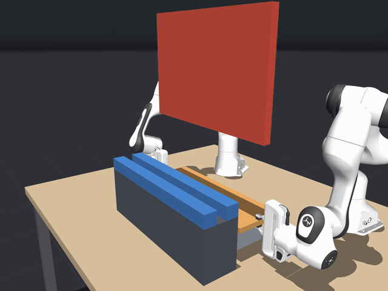
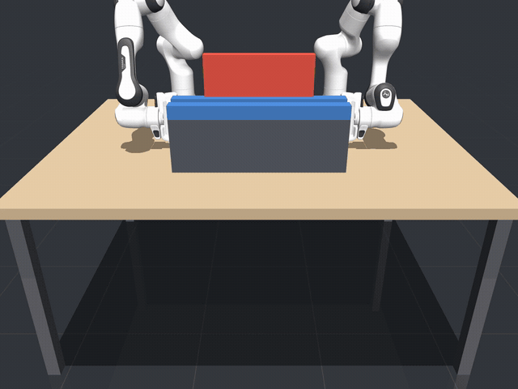
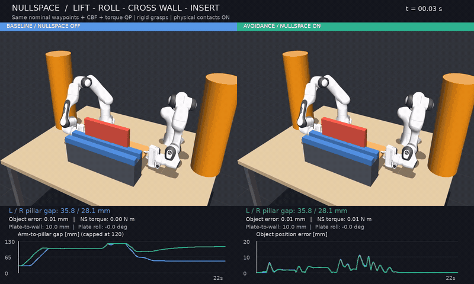
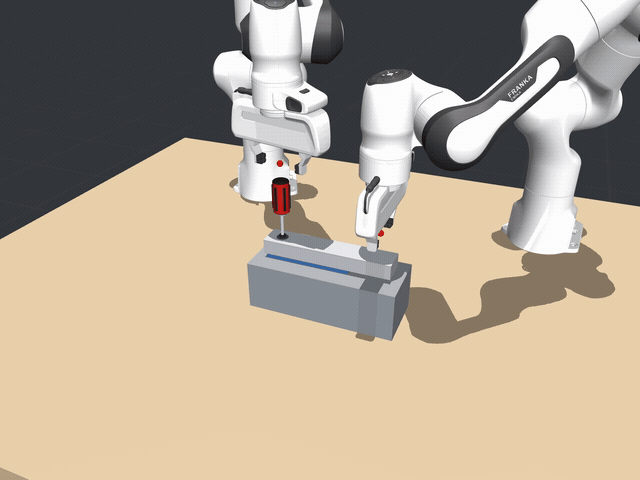
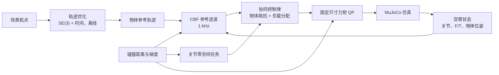

# Dual-Arm Cooperative Manipulation

[](https://github.com/haot1an/dual-arm-cooperative-manipulation/actions/workflows/ci.yml)

基于 C++17、Eigen 与 MuJoCo 的双 Franka Panda 闭链协作操作平台：协同搬运、窄槽插入、非对称螺钉装配。
避障分三层：**物体空间轨迹优化**决定怎么走，**CBF 参考滤波**保证执行中不撞，**力矩级 QP** 最后兜底；
每臂 1 维冗余用**关节零空间任务**调整肘部构型。抓取可用刚性 weld，也可用手指摩擦接触（含抓取对准）。



*`slot_gate`：长板须从低矮横梁下方穿过再插入窄槽。物体 SE(3) + 时间联合优化找到“边抬升边滚转、约 60° 斜着穿梁”的路径，
到达时间从 15.5 s 缩短到 7.6 s。*

> 当前状态：130/130 自动测试通过；控制循环（含零空间任务、CBF 与规划后的参考）零动态内存分配；7 个任务级验收场景全部通过。

## 核心能力

- **协同控制**：抓取矩阵、绝对 / 相对 Jacobian、物体空间阻抗、加权负载分配（接触模式感知指垫抗扭能力）、内力零空间投影与监测。
- **力矩级 QP**：固定尺寸 `ddq(14) + lambda(6) + slack(8)`，统一闭链等式、关节预测约束、力矩界与碰撞速度阻尼。
- **轨迹优化**：TrajOpt 风格序列凸规划，碰撞覆盖物体与闭链 IK 下的两臂；
  物体 SE(3) + 时间联合优化，多初值应对局部解。
- **CBF 参考滤波**：以偏移速度与虚拟时间为变量，每周期精确求解 3–4 维 QP（LDP / NNLS）。
- **关节零空间**：动力学一致力矩投影 `Nᵀ`，姿态保持、关节限位与机械臂构型避障，保护两手 TCP；默认关闭。
- **非对称装配**：一臂稳定工件，另一臂在螺旋副的 5 维约束空间内预紧、对准，入座后切换导纳式拧紧。
- **接触夹取**：两指联动可动夹爪、椭圆摩擦锥 + noslip、抓取对准（预抓取 → 接近 → 对准 → 闭合）。
- **工程**：plant 与控制器模型分离（可注入基座标定误差与外部 wrench）；定长 Eigen，`malloc` 插桩验证零分配。

## 代表性结果

### 规划、CBF、力矩 QP 各自的作用（`slot_gate`，刚性抓取）

| 方案 | 完成插槽 | 最大跟踪误差 | 板 ~ 横梁 | 两臂 ~ 横梁 | 到达 |
|---|---|---:|---:|---:|---:|
| **联合优化 + CBF + QP** | 是 | **8.5 mm** | 26.1 mm | 18.6 mm | **7.60 s** |
| 只平移规划 + CBF + QP | 是 | 9.3 mm | 19.5 mm | 36.5 mm | 15.49 s |
| 只用 CBF（逃逸方向向上） | **否**（离目标 95 mm） | 275 mm | 7.5 mm | 10.0 mm | — |
| 只用力矩 QP | 是 | 160 mm | 9.8 mm | 10.1 mm | 15.45 s |

局部方法能保证不撞，但选不对绕行方向；规划决定方向，联合优化还能调整姿态、压缩时间（同速度上限下仍为 8.96 s）。

### 规划之后为什么还需要 CBF（执行层偏差）

规划器以为横梁高 3 cm，和 / 或穿梁时受向上 20 N 推力；距离为真实环境下的最小值，负值为穿透：

| 偏差 | 只按规划执行 | 规划 + 力矩 QP | 规划 + CBF + QP |
|---|---|---|---|
| 地图误差 | 穿透 12.6 mm | 10.1 mm，内力 13.0 N | 10.6 mm，内力 7.2 N |
| 推力 | 穿透 1.1 mm | 10.1 mm，内力 9.7 N | 11.4 mm，内力 7.1 N |
| 两者叠加 | 穿透 28.3 mm | 9.1 mm，两臂 12.3 mm，内力 36.3 N | 10.6 mm，两臂 34.5 mm，内力 28.3 N |
| 地图误差 + 接触夹取 | — | **失接触，任务失败** | 通过 |

力矩 QP 在关节层“硬拦”时参考仍往障碍里走，两臂隔着物体较劲；CBF 在参考层做最小修正。
复现：`./scripts/run_execution_deviation.py`。

### 在线避障：CBF 参考滤波 vs 状态机（`slot_avoid`，关闭物理接触）

| 指标 | 普通 `coop` | 状态机 | CBF（默认） |
|---|---:|---:|---:|
| 板 ~ 墙最小距离 | −30.2 mm | 10.0 mm | 10.0 mm |
| 最大参考偏移 | 0 | 150 mm（固定） | 133.5 mm（按需） |
| 最大位置跟踪误差 | 8.7 mm | 14.0 mm | 11.1 mm |
| 到达目标（2 mm 内） | — | 14.62 s | 14.45 s |

### 关节零空间：物体轨迹不变，手臂让开障碍

`slot_avoid_nullspace`：越墙插槽 + 两根圆柱，刚性抓取、物理接触开启，只切换零空间任务。

| 指标 | 零空间关闭 | 零空间开启 |
|---|---:|---:|
| 插槽阶段（t ≥ 14 s）左 / 右臂到圆柱最小间隙 | 55.8 / 48.5 mm | **89.7 / 87.6 mm** |
| 物体最大位置误差 | 11.14 mm | 10.74 mm |
| 板 ~ 墙 / 板 ~ 槽最小距离 | 10.00 / 1.00 mm | 10.00 / 1.00 mm |

零空间只能改变肘部构型，不能改变手的位置。`slot_gate` 中离横梁最近的是手（约 19 mm），
所以零空间对横梁距离没有作用（开 / 关均为 19.1 / 18.6 mm），这部分由轨迹规划负责。

性能数字来自普通 Linux Release 构建，属于面向 1 kHz 的 soft real-time 结果，不代表 hard real-time 保证。

## Demo

### 在线避障（`slot_avoid`，CBF 参考滤波）



```bash
./build/run_sim --scene slot_avoid --controller qp_coop --duration 20 --camera cam_front \
  --set simulation.contacts=false --set 'disturbances=[]'
```

状态机版本：加 `--set controller.torque_qp.reference_governor.mode=state_machine`（[动图](docs/img/slot_avoid_autonomous.gif)）。

### 关节零空间 + 越墙插槽：插入时远离两根圆柱



[MP4](docs/img/nullspace_transport_comparison.mp4) · [曲线](docs/img/nullspace_transport_comparison.png)。
左右两侧名义航点、CBF、QP 完全相同，只切换零空间任务；插槽时肘部贴近两根圆柱，开启后两臂主动收肘。

```bash
./build/run_sim --scene slot_avoid_nullspace --controller qp_coop --duration 22 --camera cam_transport
# 关闭零空间对照：加 --set controller.coop.nullspace.enabled=false
# 一键 A/B + 验收 + 视频（需 DISPLAY、ffmpeg、Pillow）：
python3 scripts/run_nullspace_transport_demo.py --record --media-dir docs/img
```

### 接触夹取：螺钉装配（抓取对准 + 内六角螺丝刀）



左臂稳定工件，右臂预紧、对准、拧紧，最终 `HOLD`。刚性基线：螺钉 −150.95°、预紧 5.00 / 5.00 N、拧紧力矩 0.97 / 1.00 N·m、
工件漂移 1.01 mm；接触版拧紧力矩 0.999 / 1.0 N·m。

```bash
./build/run_sim --scene assembly --controller qp_asym_coop --contact-grasp --check-contact --camera cam_front --duration 21
```

接触模式（`--contact-grasp`）要点：椭圆摩擦锥 + noslip 消除软接触摩擦的蠕滑（金字塔锥下工具相对手偏移约 30 mm、拧不紧）；
两指以 joint equality 联动；抓取对准约 2.4 s 完成；接触模式下绕指垫法向的手部力矩权重 ×100，避免把物体力矩压到平行夹爪最弱的方向。

| 接触任务（`ctest -R ContactGrasp`） | 结果 |
|---|---|
| `slot` | 对准误差 0.33 mm；终态 0.8 mm / 0.2° |
| `slot_avoid`（CBF） | 终态 1.0 mm / 0.03° |
| `slot_gate`（联合优化 + CBF） | 终态 0.25 mm / 0.05° |
| `slot_gate`，规划器地图误差 3 cm | 终态 0.9 mm / 0.04°（关闭 CBF 时失接触） |
| `assembly` | 螺钉 −151°、`HOLD`、拧紧力矩 0.999 / 1.0 N·m |

## 控制链路


```mermaid
flowchart LR
    W["场景航点"] --> PL["轨迹优化<br/>SE(3) + 时间，离线"]
    PL --> T["物体参考轨迹"]
    T --> G["CBF 参考滤波<br/>1 kHz"]
    S["双臂状态<br/>关节、F/T、物体位姿"] --> G
    C["碰撞距离与梯度"] --> G
    G --> N["协同控制律<br/>物体阻抗 + 负载分配"]
    C --> NS["关节零空间任务"]
    NS --> N
    N --> Q["固定尺寸力矩 QP"]
    C --> Q
    Q --> P["MuJoCo 仿真"]
    P --> S
```

## 场景

| 场景 | 任务 | 控制器 |
|---|---|---|
| `lift` | 双臂共同抬升长杆 | `coop` / `qp_coop` |
| `slot` | 长板滚转 90° 并插入窄槽 | `qp_coop` |
| `slot_avoid` | 搬运、在线越障（CBF）、滚转并插槽 | `qp_coop` |
| `slot_gate` | 轨迹规划：从低矮横梁下方穿过并插槽（联合优化） | `qp_coop` |
| `slot_avoid_nullspace` | 越墙插槽 + 两根圆柱，插槽时零空间收肘 | `qp_coop` |
| `assembly` | 左臂稳定工件、右臂用螺丝刀旋入螺钉 | `asym_coop` / `qp_asym_coop` |
| `assembly_simple` | 双臂共同施加装配转矩 | `coop` |

## 编译与运行

依赖：CMake ≥ 3.16、C++17、MuJoCo 3.12.0、Eigen 3.4、yaml-cpp 0.8、GTest 1.14、GLFW 3.3（可视化）；
Python 3 + NumPy / Matplotlib（绘图），ffmpeg / Pillow（录制视频，可选）。

```bash
cmake -S . -B build -DCMAKE_BUILD_TYPE=Release   # MuJoCo 不在默认路径时加 -Dmujoco_DIR=/path/to/mujoco/lib/cmake/mujoco
cmake --build build -j"$(nproc)"
ctest --test-dir build --output-on-failure

./build/run_sim --scene slot_gate --controller qp_coop --duration 12 --camera cam_side \
  --set simulation.contacts=false --set 'disturbances=[]'
```

`--headless` 无界面全速运行，`--record out.mp4` 离屏录像；窗口内 `Space` 暂停、`V` 切换相机、`T` 透明、`C` 显示接触力。
每次运行在 `logs/<timestamp>_<scene>_<controller>/` 保存 `log.csv`、实际配置 `config.yaml`，规划时另有 `planned_path.csv`；
`python3 scripts/plot_log.py` 绘图。

## 实验脚本

| 脚本 | 内容 |
|---|---|
| `./scripts/run_acceptance_suite.py` | 7 个核心场景的任务级验收（阈值见 [config/acceptance.json](config/acceptance.json)） |
| `./scripts/run_execution_deviation.py` | 执行层偏差：地图误差 / 推力 / 叠加 × 三种执行配置 + 接触夹取 |
| `./scripts/run_robustness_sweep.py --trials 12 --seed 20260923` | `slot_avoid` 随机基座外参 + 外部 wrench 扫参（12/12 通过，最小障碍距离 9.91 mm） |
| `python3 scripts/run_nullspace_transport_demo.py` | 零空间 OFF / ON 的 A/B 验收（`--record` 生成视频） |
| `./scripts/run_experiment_matrix.py` | 状态机 governor 的消融与鲁棒性组 |
| `./scripts/run_realtime_benchmark.py --duration 60` | 持续 1 kHz soft real-time 测量（mean / P99 / P99.9 / max） |

## 建模边界

- 刚性基线以 `weld` 表示抓取；接触模式的抓取点由场景给定，没有抓取规划与滑移恢复；控制器名义模型采用固定手指近似。
- 轨迹优化是局部方法、只在任务开始前运行一次；距离只在节点处约束。
- CBF、QP 与零空间任务用名义模型计算距离，看不到基座标定误差；控制器使用的物体位姿为仿真真值（相当于理想动捕）。
- 零空间任务进入 QP 后没有严格任务优先级；接触夹取与非对称装配尚未接入。
- 性能数据只说明本机满足 1 kHz 计算预算，不能替代实时系统上的 worst-case 延迟验证。

## 目录

```text
apps/      run_sim 主程序、独立接触抬升实验        config/   公共参数、场景与验收阈值
include/   公共接口                              src/      控制、QP、CBF、规划、零空间、碰撞与仿真
models/    工作站与 Franka MJCF / mesh            scripts/  实验脚本与绘图
tests/     GTest 与零分配测试                     tools/    标定与场景设计工具
docs/img/  README 动图
```

## License

项目自身代码使用 [MIT License](LICENSE)。`models/franka_emika_panda/` 中的第三方模型遵循其目录内的独立许可证。
